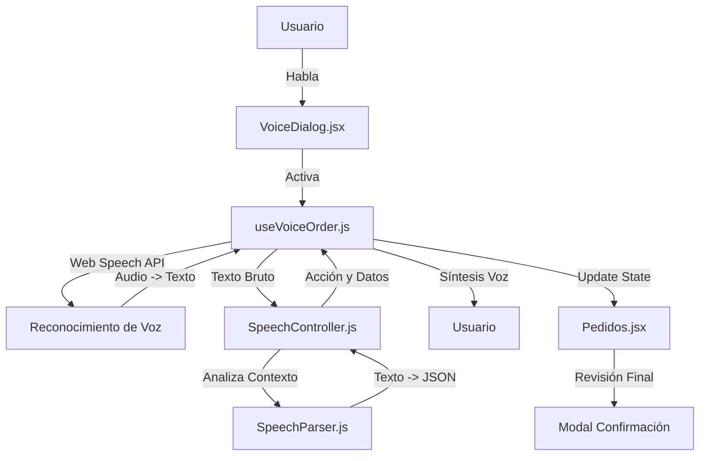

# 🎙️ Sistema Pro de Registro por Voz - ENIGMA ERP
## Guía Técnica y Académica (v5.0 - Enero 2026)

Este documento está diseñado para explicar detalladamente el funcionamiento del sistema de voz, ideal para una sesión de revisión de código o una clase de programación avanzada sobre **Interfaces de Voz (VUI)** y **React Hooks**.

---

## 🏗️ 1. Arquitectura y Flujo de Datos

El sistema sigue un modelo de **Arquitectura Desacoplada** donde la interfaz, la lógica de control y el procesamiento de lenguaje natural (NLP) están en capas separadas.

### 📊 Diagrama de Flujo

---

## 📂 2. Función de los Archivos (El Equipo de Trabajo)

| Archivo | Rol | Concepto de Programación |
| :--- | :--- | :--- |
| `useVoiceOrder.js` | **Motor (Engine)** | `Custom Hook`: Gestiona el ciclo de vida del micrófono, Wake Lock y la lógica de tiempos. |
| `speechController.js` | **Cerebro (State Machine)** | `Clase ES6`: Orquestador que sabe en qué pregunta estamos y qué sigue después. |
| `speechParser.js` | **Traductor (NLP)** | `Functional Logic`: Limpia el texto y extrae datos útiles (números, booleanos, fechas). |
| `VoiceDialog.jsx` | **Cara (UI)** | `React Component`: Representación visual del estado (Escuchando, Procesando, Dormido). |

---

## 🚀 3. Innovaciones y "New Experience" (UX Advanced)

En esta versión (v5.0) se han implementado mejoras críticas para una experiencia "Premium":

### A. 📱 Prevención de Suspensión (Wake Lock API)
Para evitar que el teléfono se bloquee mientras el usuario dicta un pedido largo:
- **Implementación:** Se solicita un `wakeLock` al iniciar la sesión y se libera al terminar.
- **Beneficio:** Flujo ininterrumpido sin tocar la pantalla.

### B. ⏱️ Regla de Oro: Silencio Dinámico
No todos los campos son iguales. El tiempo que el sistema espera antes de "cerrar el micrófono" varía:
- **Campos Rápidos (1.0s - 1.5s):** Cantidad, Nombre, Teléfono.
- **Campos de Dictado (4.0s - 5.0s):** Detalles del producto y Dirección de entrega.

### C. 🛑 Comandos de Cierre Verbal
Implementamos "Shortcuts" globales. Decir **"Listo"**, **"Terminé"** o **"Fin"** corta el proceso y guarda lo capturado inmediatamente, ideal para usuarios expertos.

### D. 🧠 Psicología del Feedback
Se cambió el enfoque de "Error" por "Acompañamiento":
- **Antes:** "No entendí, repite" (Genera estrés).
- **Ahora:** "Te escucho, continúa cuando desees" (Reduce la ansiedad del usuario).

---

## 🛠️ 4. Procesamiento de Errores y Robustez

1.  **Reintentos Suaves:** Si hay un error de red o timeout, el sistema no se rompe; simplemente pide al usuario que continúe.
2.  **Validación de Obligatorios:** El `Controller` bloquea el avance si falta un dato crítico (como el precio), insistiendo amablemente.
3.  **Sanitización de Datos:** El `Parser` procesa "cincuenta soles" -> `50.00`, eliminando caracteres especiales y normalizando mayúsculas.

---

## 🎓 5. Explicación para Clase de Programación

### ¿Por qué usar un State Machine? (`speechController.js`)
En lugar de un montón de `if/else`, usamos una clase que mantiene el `paso` actual. Esto permite que el sistema sea escalable: añadir una nueva pregunta es tan fácil como agregar un objeto al array `FLUJO`.

### ¿Por qué Regex en el Parser? (`speechParser.js`)
Usamos expresiones regulares para extraer números del habla. El lenguaje natural es "sucio" (ej: "son como 50 soles más o menos"). El Regex `/(\d+(?:\.\d+)?)/` garantiza que el sistema solo capture el valor numérico.

### El Desafío de los "Closures" en React
En `useVoiceOrder.js`, usamos `useRef` para el `transcriptActual` porque los eventos del navegador (`onend`) capturan el estado inicial (stale closures). El `ref` nos permite acceder siempre al valor más reciente.

---
**Tecnología:** Web Speech API (Recognition + Synthesis), Wake Lock API, React 18 Hooks.
**Desarrollado por:** Antigravity AI / Enigma Artesanías.
